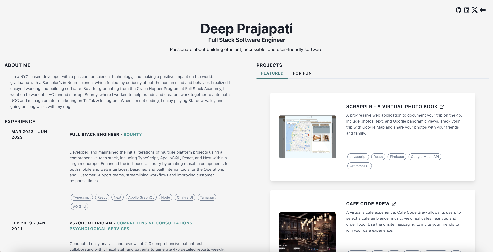

<p align="center">
  
</p>


The second iteration of [https://deepprajapati.vercel.app](https://deepprajapati.vercel.app/) built using [Next.js](https://nextjs.org/) and hosted on [Vercel](https://vercel.com).
&nbsp;

---

<!-- *** -->


## Installation and Set Up

1. Install and ensure you're using the correct version of Node using [NVM](https://github.com/nvm-sh/nvm)

```sh
nvm install
```

2. Install dependencies

```sh
npm install
```
3. Run the development server:

```sh
npm run dev
```

Open [http://localhost:3000](http://localhost:3000) with your browser to see the result.

## **Contact**

---

[Deep Prajapati](mailto:dprajap2@gmail.com?subject=[GitHub])

[LinkedIn](https://www.linkedin.com/in/deepprajapati)

[Github](https://github.com/dprajapati4/)
